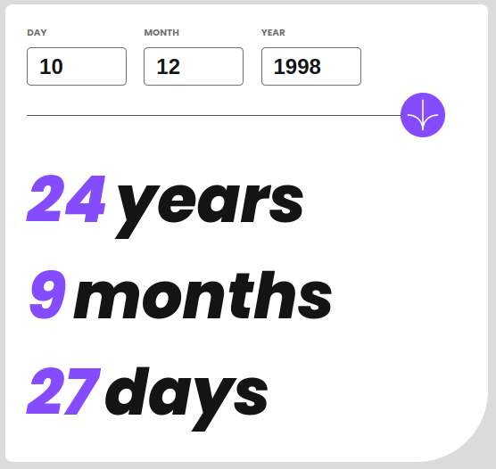
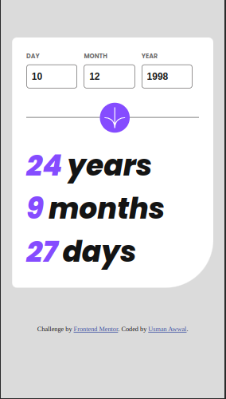

# Frontend Mentor - Age calculator app solution

This is a solution to the [Age calculator app challenge on Frontend Mentor](https://www.frontendmentor.io/challenges/age-calculator-app-dF9DFFpj-Q). Frontend Mentor challenges help you improve your coding skills by building realistic projects. 

## Table of contents

- [Overview](#overview)
  - [The challenge](#the-challenge)
  - [Screenshot](#screenshot)
  - [Links](#links)
- [My process](#my-process)
  - [Built with](#built-with)
  - [What I learned](#what-i-learned)
  - [Continued development](#continued-development)
- [Author](#author)
- [Acknowledgments](#acknowledgments)

**Note: Delete this note and update the table of contents based on what sections you keep.**

## Overview

### The challenge

Users should be able to:

- View an age in years, months, and days after submitting a valid date through the form
- Receive validation errors if:
  - Any field is empty when the form is submitted
  - The day number is not between 1-31
  - The month number is not between 1-12
  - The year is in the future
  - The date is invalid e.g. 31/04/1991 (there are 30 days in April)
- View the optimal layout for the interface depending on their device's screen size
- See hover and focus states for all interactive elements on the page
- **Bonus**: See the age numbers animate to their final number when the form is submitted

### Screenshot




### Links

- Solution URL: [Github repository](https://github.com/USII-004/frontend-mentor-ageCalculator)
- Live Site URL: [Netlify app](https://fm-age-calc.netlify.app/)

## My process

### Built with

- Semantic HTML5 markup
- CSS custom properties
- Flexbox
- CSS Grid
- Mobile-first workflow


### What I learned

In this challenge I learned lot of stuffs like how javascript functions are executed in the browser, therefore properly ordering the decralations in the functions arer important to avoid calling a value that is not yet assigned to a function.

When working on the horizontal divider and icon, I had to use two different div element, so the event listener added to buttons only works on mobile view since it's the first div element with that id. I had to change the id of the desktop button and apply subsequent js function and event lister to it, before I can get the button to work on desktop. 

Addin the count up function to animate the numbers to it's final value was a bit tricky, used chat GPT for it, and still trying to understand the concept used.


```html
<div class="divider__container">
  <div class="mobile__divider">
    <div class="horizontal__line"></div>
    <button class="svg__btn" id="svg-btn">
      <svg class="svg__image" xmlns="http://www.w3.org/2000/svg" id="svg-img" viewBox="0 0 46 44" width="44" height="44" overflow="visible"><g fill="none" stroke="#FFF" stroke-width="2"><path d="M1 22.019C8.333 21.686 23 25.616 23 44M23 44V0M45 22.019C37.667 21.686 23 25.616 23 44"/></g></svg>
    </button>
    <div class="horizontal__line"></div>
  </div>
  <div class="desktop__divider">
    <div class="horizontal__line"></div>
    <button class="svg__btn" id="desktop-svg-btn">
      <svg class="svg__image" xmlns="http://www.w3.org/2000/svg" id="svg-img" viewBox="0 0 46 44" width="44" height="44" overflow="visible"><g fill="none" stroke="#FFF" stroke-width="2"><path d="M1 22.019C8.333 21.686 23 25.616 23 44M23 44V0M45 22.019C37.667 21.686 23 25.616 23 44"/></g></svg>
    </button>
  </div>
</div>
```
```css
.input input {
  margin: 0.3rem 0;
  width: 100%;
  height: 2.5rem;
  display: block;
  border-radius: .3rem;
  color: var(--text-color);
  font-size: var(--medium-text-size);
  font-weight: var(--font-bold);
  padding-left: .5rem;
  &:hover {
    border-color: var(--accent-color);
  }
}

.mobile__divider {
  display: grid;
  grid-template-columns: 42.5% 15% 42.5%;
  margin: 1.2rem 0;
}

.desktop__divider {
  display: none;
}
```
```js
desktopSubmitButton.addEventListener('click', () => {
  const year = yearInput.value
  const month = monthInput.value
  const day = dayInput.value

  // Array to store the number of days in each month (0 index-based)
  const daysInMonth = [
    0, 31, 28, 31, 30, 31, 30, 31, 31, 30, 31, 30, 31
  ];

  // Adjust February days for leap years
  if (year % 4 === 0 && (year % 100 !== 0 || year % 400 === 0)) {
    daysInMonth[2] = 29;
  }

  if (day < 1 || day > daysInMonth[month]) {
    dayLabel.classList.add('error__state__color')
    dayInput.classList.add('input__error__state')
    dayErrorMsg.classList.add('error__state__color')
    dayErrorMsg.innerText = 'Please enter a valid month'

    return;
  }
  
  if (year > currentDate.getFullYear()) {
    yearLabel.classList.add('error__state__color')
    yearInput.classList.add('input__error__state')
    yearErrorMsg.classList.add('error__state__color')
    yearErrorMsg.innerText = 'Please input a year that is not in the future'

    return;
  } 
  // create birthdate string using the input vlues above
  const birthDate = `${year}-${month}-${day}`

  // calculate age
  const age = calculateAge(birthDate)

  // display age
  yearDisplay.innerText = `${age.years}`
  monthDisplay.innerText = `${age.months}`
  dayDisplay.innerText = `${age.days}`
})
```


### Continued development

I will explore more on employing the mobile fist development approach, as this makes designing more easier and faster. 


## Author

- Github - [@USII-004](https://github.com/USII-004)
- Frontend Mentor - [@USII-004](https://www.frontendmentor.io/profile/USII-004)
- Twitter - [@usman_smooth](https://twitter.com/usman_smooth)

## Acknowledgments

credits to chat GPT, twitter dev's, freeCodeCamp and numerous youtube tutorials for showing me some of the concept I used in this challenge.
